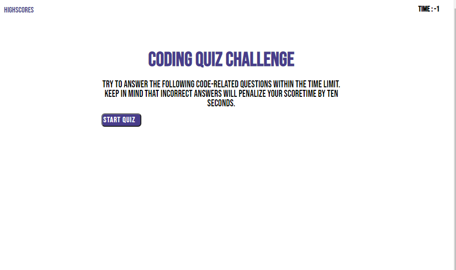

# coding_quiz

## Description

The motivation of this project was to be able to use my newfound knowledge of DOM to use elements and button to varying degrees. The ability to manipulate css is js is something that must be learned for me to further my career in being a developer. This project gives the user a four question quiz about coding and times the person and allows them to enter their score with their initials into a local variable. This project taught me how to manipulate elements without the use of jQuery and the to triple check all my spelling (bye bye hours of my life for a capital "P").

## Usage

The game will start on the menu. To check previous scores press highscores if not the game starts whem you hit the start button. Then you will answer the following question by clicking the correct answer button, then all is done you enter initials and hit submit and it shows the highscores. Then you can either go back or reset the list.

## Credits
Kenneth Felix
https://axumdzn.github.io/coding_quiz/
